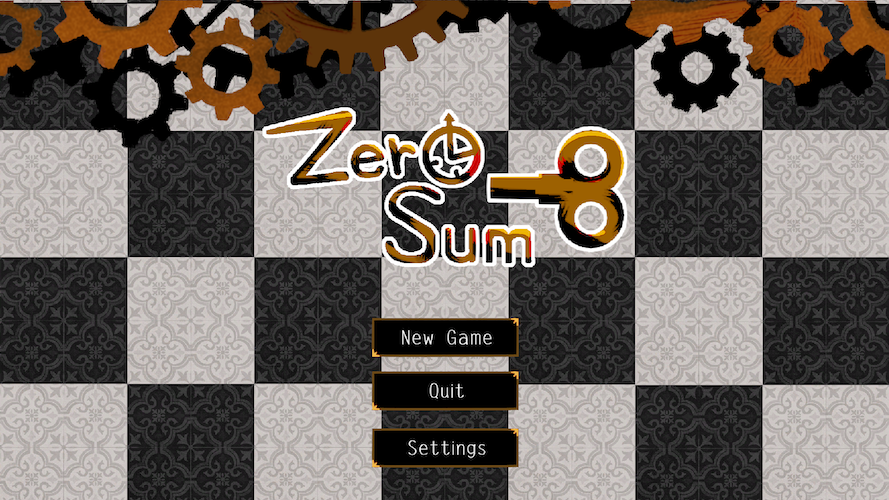

# Before the Spring Runs Out

中文名：**发条归零之前**  
日本語名：**ゼンマイが尽きる前に**  
开发代号 / Unity Product Name：**ZeroSum**



GMTK Game Jam 2026 完赛项目。主题为 **COUNTDOWN**，类型为俯视角网格探索、回合制战斗与风险结算。

玩家被诅咒成发条小人，Point 同时代表生命、时间、行动成本和货币。玩家需要穿过迷雾森林，击败其他发条生物并回收点数，最终击败两阶段 Boss“哀叹之钟”。

> 项目状态：已完赛，进入维护与归档阶段  
> Unity：2022.3.62f3  
> 主要平台：WebGL / Windows / macOS  
> 最后核对：2026-07-28

---

## 快速开始

1. 使用 Unity Hub 以 **Unity 2022.3.62f3** 打开项目。
2. 打开 `Assets/Scenes/Persistent.unity`。
3. 等待 Unity 完成资源导入，确认 Console 没有编译错误。
4. 点击 Play。
5. 游戏会先进入标题界面，再由 `GameManager` 加载正式关卡。

不要把直接运行 `GameScene.unity` 当作完整验收方式。单独运行关卡场景可能缺少常驻玩家、UI、音频和流程管理对象。

### 主要场景

| 场景 | 用途 |
|---|---|
| `Persistent.unity` | 常驻系统、玩家、UI、GameManager、AudioManager；完整试玩入口 |
| `TitleScene.unity` | 标题界面 |
| `GameScene.unity` | 正式 12×12 游戏关卡 |
| `GameSceneOrigin.unity` | 旧版 / 参考场景，不是当前正式关卡 |

Build Settings 当前顺序为：

1. `Persistent`
2. `TitleScene`
3. `GameScene`
4. `GameSceneOrigin`

---

## 操作

| 功能 | 操作 |
|---|---|
| 地图移动 | `W / A / S / D` 或方向键 |
| 普攻 | `F` |
| 技能槽 1 / 2 / 3 | `Q / E / R` |
| 打开道具菜单 | `Z` |
| 使用道具槽 1～4 | `1 / 2 / 3 / 4` 或小键盘 |
| 从道具菜单返回 | `Esc` |
| 菜单与地图交互 | 鼠标 |

战斗没有独立的“防御”行动。一级战斗菜单由普攻、三个技能槽和道具入口组成。

---

## 文档导航

| 文档 | 什么时候看 |
|---|---|
| [完赛版 GDD](Docs/Zero_GDD.md) | 查询当前机制、数值、结算顺序和代码入口 |
| [策划配置与关卡编辑指南](Docs/Designer_Config_and_Level_Guide.md) | 修改地图点、敌人、技能、商店、供奉、音频和调试参数 |
| [本地化 Key 字典](Docs/Localization_Key_Dictionary.md) | 查询文本 Key、占位符、动态 Key 和当前调用位置 |
| [历史 GDD](Docs/archive/) | 查看开发过程中曾经计划过的系统设计 |

README 只负责项目入口和常用操作。机制细节以 GDD 为准，具体配置步骤以策划指南为准。

---

## 数据与规则的真实来源

出现文档与游戏不一致时，按以下优先级确认：

1. Unity 场景、Prefab 和 ScriptableObject 决定实际关卡内容与配置数值。
2. `Assets/Game/Runtime` 下的代码决定结算顺序和边界规则。
3. `Assets/GameData/database.xlsx` 是本地化源表。
4. `Assets/Resources/GameData/database.json` 是运行时本地化数据。
5. GDD 和其他文档用于理解、定位和维护。

修改游戏机制后，应同步检查配置资产、三语描述、GDD 和策划指南。

---

## 项目结构

```text
Assets/
├── Game/
│   ├── Data/                  技能、敌人、道具、商店和供奉配置
│   └── Runtime/
│       ├── Core/              场景、UI、数据加载、随机等基础系统
│       ├── Data/              本地化和通用数据结构
│       └── Gameplay/          网格、迷雾、战斗、背包和世界事件
├── GameData/
│   ├── database.xlsx          本地化源表
│   └── AudioList.xlsx         音频整理表
├── Resources/
│   └── GameData/database.json 运行时本地化数据
└── Scenes/                    Persistent、标题、正式关卡与参考场景

Docs/                          当前文档和历史设计归档
ProjectSettings/               Unity 工程与 Build Settings
Packages/                      Unity Package 配置
```

`Library`、`Temp`、`obj`、`Logs`、平台构建目录和 IDE 工程文件均为生成内容，不是项目源文件。

---

## 核心系统入口

| 想查什么 | 主要入口 |
|---|---|
| 游戏状态、场景切换、胜负与重试 | `GameManager.cs`、`TransitionManager.cs` |
| Point、死亡边界 | `NumberResource.cs` |
| 网格移动、接触触发、角色朝向 | `PlayerGridController.cs`、`GridMap.cs` |
| 迷雾与视野 | `FogOfWarSystem.cs` |
| 整场战斗、回合、技能、道具与奖励 | `EncounterController.cs` |
| 敌人生命、意图、特殊行为 | `EnemyActor.cs`、`EnemyDefinition.cs` |
| 战斗菜单与键盘快捷键 | `BattleActionPanel.cs` |
| 背包、堆叠与藏品耐久 | `PlayerInventory.cs` |
| 临时战斗状态 | `PlayerRunStats.cs` |
| 篝火、商店、供奉、交换与宝藏 | `Gameplay/World/*Interactable.cs` |
| 世界交互面板 | `CampfirePanel.cs`、`ShopPanel.cs`、`OfferingPanel.cs` |
| 本地化 | `GameLocalization.cs`、`DataLoader.cs` |
| 音频 | `AudioManager.cs`、`AudioInfoListSO.asset` |

完整模块说明见 [完赛版 GDD：代码模块地图](Docs/Zero_GDD.md#12-代码模块地图)。

---

## 常用维护操作

### 修改本地化

1. 打开 `Assets/GameData/database.xlsx`。
2. 编辑 `Localization` Sheet。
3. 同时维护 English、Chinese、Japanese，并保留 `{0}`、`{1}` 等占位符。
4. 保存并关闭 Excel，避免文件锁定。
5. 回到 Unity 执行 `Tools > Export Database To JSON`。
6. 确认 `Assets/Resources/GameData/database.json` 已更新。
7. 在游戏中切换三种语言验证。

运行时只读取导出的 JSON。缺失文本会显示 `[MISSING:语言:Key]`，格式错误会显示 `[FORMAT:语言:Key]`。

### 修改地图、数值和事件

- 地图与事件摆放：修改 `GameScene.unity`。
- 玩家初始 / 最大 Point、移动成本和基础战斗参数：修改 `Persistent.unity > Player`。
- 敌人：修改 `Assets/Game/Data/Enemies`。
- 技能：修改 `Assets/Game/Data/Skills`。
- 道具与藏品：修改 `Assets/Game/Data/Collectibles`。
- 商店和供奉：修改 `Assets/Game/Data/Shops` 与 `Assets/Game/Data/Offerings`。

具体字段和安全编辑方式见[策划配置与关卡编辑指南](Docs/Designer_Config_and_Level_Guide.md)。

### 修改音频

- 音频播放入口：`AudioManager.cs`
- 名称映射：`AudioInfoListSO.cs` 中的 `AudioName`
- 配置资产：`AudioInfoListSO.asset`
- 同步菜单：`Tools > Zero > Synchronize Audio Info List`

同步操作会重建映射，执行后需要检查 Inspector 和 Git Diff。

---

## 调试与验证

当前工程没有独立的策划调试面板或一键作弊开关。临时测试主要通过 Inspector 调整：

- 将迷雾 `Vision Radius` 改为 20，可快速查看完整地图。
- 临时提高 `Basic Attack Damage`，可快速测试战斗结算。
- 调整 `NumberResource` 的初始值和最大值，可测试濒死与高 Point。
- 将 `Greedy Success Chance` 改为 0 或 1，可固定贪婪失败或成功。
- 将 `Move Duration` 改为 0，可加快地图测试。
- 将目标敌人或事件 Prefab 临时放到出生点旁，可快速进入对应流程。

这些修改可能进入 Git 变更。测试结束后应检查差异，不要只依赖记忆恢复参数。

---

## 构建

项目使用 Unity 标准 Build Settings，没有额外的自动构建脚本。

1. 从 `Persistent.unity` 完整 Play 一次。
2. 确认 Build Settings 中场景顺序正确。
3. 选择 WebGL、Windows 或 macOS 平台。
4. 执行 Build。
5. 在目标平台完成一次完整流程测试。

当前本地构建目录为 `WebBuile`、`Windows` 和 `MacBuild`，均已被 Git 忽略。

桌面版可以通过设置面板退出程序。WebGL 浏览器通常不允许游戏主动关闭标签页，因此退出按钮可能没有可见效果。

---

## 构建前回归清单

- [ ] 从 `Persistent.unity` 进入标题并开始新游戏。
- [ ] WASD / 方向键移动、Point 消耗和迷雾刷新正常。
- [ ] `F / Q / E / R / Z / 1～4 / Esc` 在正确菜单生效。
- [ ] 所有普通敌人的意图、血条和奖励结算正常。
- [ ] 惊魂匣掉落道具并显示三行奖励提示。
- [ ] 仓鼠攻击、偷取和逃跑流程正常。
- [ ] Boss 两阶段切换、意图与胜利流程正常。
- [ ] 篝火、商店、供奉、交换和宝藏交互正常。
- [ ] 战斗道具状态不会带入下一场战斗。
- [ ] English / Chinese / Japanese 均无 `[MISSING]` 或 `[FORMAT]`。
- [ ] 失败图片、胜利标题、重试和返回标题正常。
- [ ] Windows / macOS 可以退出；WebGL 点击退出不会报错。
- [ ] Console 没有新增红色错误。

---

## 已知注意事项

- `GameSceneOrigin.unity` 是旧版参考场景；正式修改应放在 `GameScene.unity`。
- `EncounterController` 是有意采用的集中式战斗编排器，不存在早期设计中的多个独立 Resolver。
- `CampfirePanel` 同时服务篝火与宝藏；`ShopPanel` 同时服务商店与交换。
- 本地化没有手写 fallback，Excel 导出遗漏会直接显示为 `[MISSING]`。
- 当前没有可由策划直接开启的固定随机种子入口。
- 平台构建目录不纳入版本控制，需要单独保存发布包。

---

## 项目历史

- 2026-07-23：项目建立。
- 2026-07-24～2026-07-27：完成网格、迷雾、战斗、事件、Boss、UI、音频与本地化。
- 2026-07-27：GMTK Game Jam 版本完赛。
- 2026-07-28：完成 GDD、策划指南、本地化字典和代码库审计。

历史方案保存在 [`Docs/archive`](Docs/archive/)；它们用于回顾设计过程，不代表当前实现。
